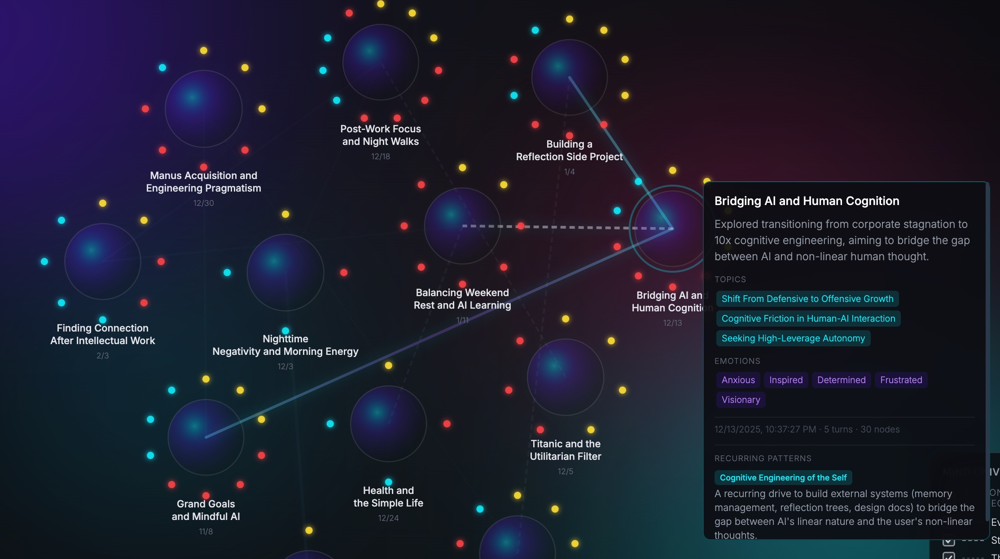
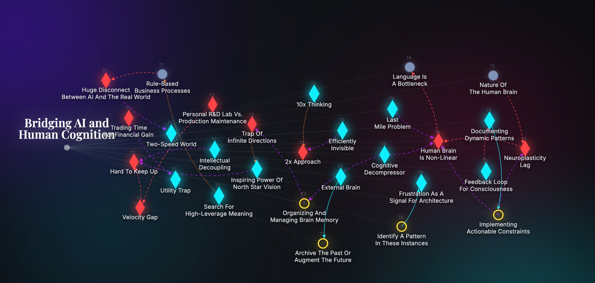

# YMind

**Transform conversations into dynamic mind maps with AI-powered insight extraction.**

YMind is a real-time mind mapping tool that uses LangGraph and Google Gemini to visualize the hidden structure of your thoughts as you chat.




---

## ✨ Features

- 🧠 **Physics of Thought Framework** - Automatically extracts facts, frictions, sparks, and actions from conversations
- 🌳 **Tree View** - Single-session mind map with real-time node updates
- 🌌 **Mind Universe View** - Cross-session pattern discovery showing how ideas evolve over time
- 💬 **AI Chat Mode** - Just type and watch your thoughts structure themselves
- 📊 **Three-Layer Data Model** - Display layer (labels), Semantic layer (summaries), Source layer (full context)
- 🎨 **Interactive Visualization** - Force-directed graph with D3.js
- 💾 **Session Management** - Save, load, and revisit past conversations

---

## 🚀 Quick Start

### Prerequisites

- Python 3.10+
- Google Gemini API Key - [Get one free](https://ai.google.dev/)

### Installation

```bash
# Clone the repository
git clone https://github.com/yourusername/ymind.git
cd ymind

# Install Python dependencies
pip install -r backend/requirements.txt

# Set up environment variables
cp backend/.env.local.example .env.local
# Edit .env.local and add your API key:
# GEMINI_API_KEY=your_key_here
```

### Run

**Step 1: Start the backend server**

```bash
# Option 1: Direct Python
python backend/main.py

# Option 2: Using uvicorn (recommended for development)
uvicorn backend.main:app --reload --host 0.0.0.0 --port 8000
```

You should see:
```
INFO:     Uvicorn running on http://0.0.0.0:8000 (Press CTRL+C to quit)
INFO:     Application startup complete.
```

**Step 2: Open the frontend**

```bash
# Simply open index.html in your browser
open index.html  # macOS
# or drag index.html to your browser
# or double-click index.html
```

The frontend will automatically connect to `http://localhost:8000` API.

That's it! Start chatting and watch your mind map grow.

---

## 🧠 How It Works

**[Watch the demo video →](https://www.youtube.com/watch?v=fyYq6WcRups)**

### Two Views, Two Scales

**🌳 Tree View** - Single-session mind map
- Real-time visualization as you chat
- Nodes appear turn-by-turn
- Shows the structure of *this* conversation

**🌌 Mind Universe View** - Cross-session pattern discovery
- Save multiple sessions over time
- AI finds hidden connections between sessions
- Reveals recurring themes, contradictions, and evolution
- Each session becomes a "planet" in your thought universe

---

### Physics of Thought: Node Types

Every conversation contains four types of building blocks:

| Type | What It Is | Example |
|------|------------|---------|
| **FACT** | Stable ground, context, background | "I've been a designer for 5 years" |
| **FRICTION** | Tension, doubt, blocker, unresolved question | "I don't know if I should switch careers" |
| **SPARK** | Insight, reframe, "aha!" moment | "Maybe I'm not bored of design—I'm bored of clients" |
| **ACTION** | Decision, next step, commitment | "Try freelancing part-time first" |

YMind automatically extracts these from your conversation using LangGraph + Gemini.

---

### Edge Types: How Nodes Connect

Nodes don't just exist—they relate. YMind detects:

- **`causes`** - One fact/friction leads to another (e.g., "Fear of failure" → "Procrastination")
- **`resolves`** - A spark or action addresses a friction (e.g., "Try small steps" → resolves → "Feeling overwhelmed")
- **`leads_to`** - A spark naturally flows into an action (e.g., "Reframe career as experiments" → "Start weekend projects")
- **`opposes`** - Two beliefs or goals contradict (e.g., "Want stability" ↔ "Want creativity")

These connections appear as visual links in the graph, making hidden patterns visible.

---

### Three-Layer Architecture

Each node is an iceberg. What you see on the canvas is just the tip:

```
┌─────────────────────────────────────┐
│  🎨 Display Layer                   │
│  label: "Career Crossroads"         │  ← Short, visible on canvas
├─────────────────────────────────────┤
│  📚 Semantic Layer                   │
│  rich_summary: "Feeling stuck       │  ← Full meaning, used for
│  between stability in current       │    embedding & tooltips
│  job vs. risk of new path..."       │
├─────────────────────────────────────┤
│  🗂️ Source Layer                     │
│  original_context:                   │  ← Full conversation snapshot:
│    - raw_text (exact words)         │    user + AI turns, timestamps,
│    - pre_text (what led here)       │    everything needed to trace
│    - post_text (what followed)      │    back to the source moment
└─────────────────────────────────────┘
```

This design ensures:
- **Fast rendering** (display layer is light)
- **Semantic search** (rich summaries are embeddable)
- **Full traceability** (you can always revisit the original conversation)

---

### The Workflow

1. **Chat naturally** - No special syntax, just talk with the AI
2. **Auto-extraction** - LangGraph analyzes each turn and identifies facts/frictions/sparks/actions
3. **Real-time visualization** - Nodes appear and connect as patterns emerge
4. **Save sessions** - Come back later, or compare sessions in Mind Universe View

---

## 📂 Project Structure

```
ymind/
├── backend/
│   ├── agents/              # LangGraph nodes (unified, summary, cross-session)
│   ├── models/              # Pydantic schemas (GraphNode, MindMapState)
│   ├── prompts/             # LLM prompt templates
│   ├── services/            # Business logic (state updater, chat generator, storage)
│   ├── workflows/           # LangGraph workflow compilation
│   └── main.py              # FastAPI server
├── outputs/
│   └── sessions/            # Persisted session data
│       └── demo/            # Demo sessions for showcase
├── index.html               # Frontend (D3.js + Chat UI)
└── README.md
```

---

## 🔌 API Endpoints

### `POST /api/chat`
Real-time chat with auto-generated AI response and mind map update.

**Request:**
```json
{
  "conversation_id": "demo",
  "user_input": "I'm stuck between two career paths"
}
```

**Response:**
```json
{
  "ai_response": "...",
  "mindmap": {
    "nodes": [...],
    "links": [...],
    "active_node_id": "uuid",
    "turn_count": 5
  }
}
```

### `POST /chat`
Manual mode - provide both user input and AI response.

### `GET /sessions?user_id=demo`
List all saved sessions.

### `POST /sessions/save`
Save current session.

### `POST /sessions/analyze?user_id=demo`
Trigger cross-session analysis (Mind Universe View).

See `backend/main.py` for full API documentation.

---

## 🧪 Tech Stack

| Component | Technology |
|-----------|------------|
| Backend | FastAPI, Python 3.10+ |
| LLM Orchestration | LangGraph |
| AI Model | Google Gemini 2.0 Flash |
| Data Validation | Pydantic |
| Visualization | D3.js (force-directed graph) |
| Storage | JSON files (local filesystem) |

---

## 🛠️ Development

### Adding a New Agent

1. Create `backend/agents/your_agent.py`
2. Define `your_agent_step(state: Dict[str, Any]) -> Dict[str, Any]`
3. Register in `backend/workflows/mindmap_workflow.py`

### Modifying Prompts

Prompt templates are in `backend/prompts/`. Each file has:
- Versioned prompt string
- Helper functions for formatting inputs
- Inline documentation

### Testing the API

```bash
# Test chat endpoint
curl -X POST http://localhost:8000/api/chat \
  -H "Content-Type: application/json" \
  -d '{"conversation_id": "test", "user_input": "Hello, tell me about YMind"}'
```

---

## 📄 License

MIT License - see [LICENSE](LICENSE) file.

---

## 🙏 Acknowledgments

Built with [LangGraph](https://github.com/langchain-ai/langgraph) and [Google Gemini](https://ai.google.dev/).

---

**Note:** This is a research prototype. Session data is stored locally in `outputs/sessions/`. For production use, consider database integration and proper authentication.
